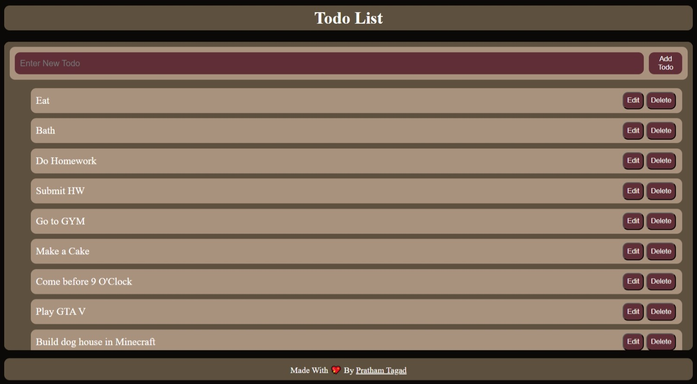

  

<h1 align="center">📝 To-Do List App</h1>

  A simple, responsive, and beginner-friendly to-do list web app built using HTML, CSS, and JavaScript. 
  Add, edit, and delete tasks, with all your data stored in <strong>localStorage</strong> so nothing gets lost on refresh!

---

## 🚀 Features

- ✅ Add new tasks
- ✏️ Edit existing tasks
- 🗑️ Delete tasks
- 💾 Persistent storage using localStorage
- 🎨 Clean and responsive UI

---

## 🛠️ Tech Used

- HTML5
- CSS3
- JavaScript (Vanilla)
- localStorage API

---

## 📷 Screenshot

  

---

## 📁 How to Use

1. Clone or download this repo
2. Open `index.html` in your browser
3. Start adding your tasks!

---

## 👨‍💻 Developer

Made with ❤️ by [Pratham Tagad](#)

---
